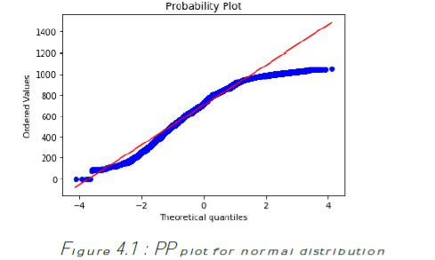
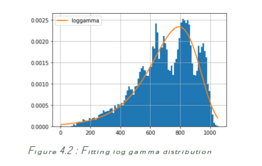
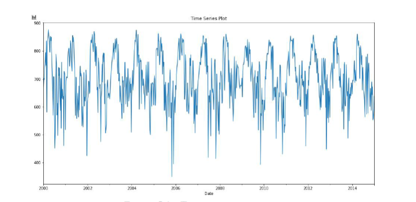
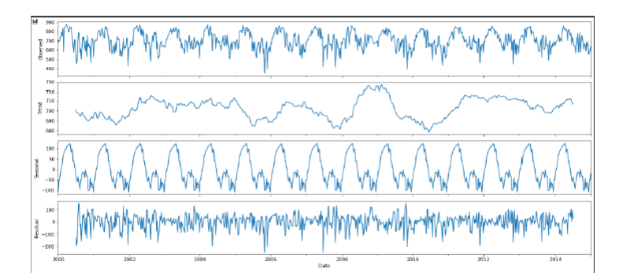
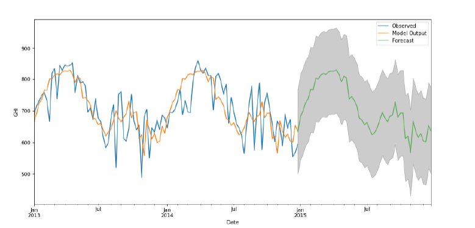

# Solar-Energy Analysis

## Introduction

#### Solar energy is the radiant light and heat energy from the Sun that is mobilized and utilized using a multitude of progressive technologies like photovoltaics, thermal power plants, concentrated solar power systems, artificial photosynthesis, etc. It is a renewable energy resource, which is widely regarded as the most pollution-free, abundant and safest resource of energy available. The development of cost-effective and inexhaustible solar technology resources can help increase sustainability, mitigate pollution, reduce the dependence on fossil fuels and control global warming. With the focus on renewable energy resources due to environmental reasons being the need of the hour, analysing and forecasting solar energy is of great importance for developing systems that harness this energy more effectively. This report focuses on the inter state analysis of solar energy data, using various statistical methods. The methodology followed in the report can be broadly divided into the following sections-
#### 1- Analysis of Solar Energy parameters and their correlation
#### 2- Determining a suitable distribution fit for the data
#### 3- Time series analysis and decomposition
#### 4- Stationarity analysis
#### 5- Finding a suitable model for forecasting
#### 6- Spatial analysis of the results for Andhra Pradesh

## Descriptive Analysis

In the available data, we saw that there are various parameters that can affect the solar radiation reaching the surface of the earth. So let us define these parameters so that we can better understand the problem and get an idea on how these variables affect each other and also the solar radiation value. Some important terminologies are discussed below:
1. Diffuse horizontal irradiance(DHI): The amount of sun’s radiation reaching the terrestrial surface per unit area which is scattered by the atmosphere is known as Diffuse Horizontal Irradiance. It does not include the radiation that comes on the direct path from the sun.
2. Direct Normal Irradiance(DNI): As the name suggests, the radiations received per unit area from the sun to the earth’s surface that are normal to the surface is known as Direct Normal Irradiance. Typically, we can maximize the amount of irradiance annually received by a surface by keeping it normal to incoming radiation.
3. Solar-Zenith Angle: It is defined as the angle between the vertical and the sun’s ray.
4. Global Horizontal Irradiance(GHI): The total amount of short wave radiation received per unit area from above by the horizontal earth’s surface is known as GHI or Global Horizontal Irradiance. Its value includes both the DHI and DNI components for a particular value of the Solar-Zenith Angle. Mathematically it can be expressed as: GHI = DHI + DNI · cos (θ) (where θ is the solar zenith angle)
The data also includes several other variables like Clearsky DHI, Clearsky DNI, Clearsky GHI, Dew Point, Temperature, Pressure, Relative Humidity, Snow Depth and Wind Speed. The explanation of all these variables is beyond the scope of the report.

## GHI DATA ANALYSIS

In order to test whether these datasets follow our specific distributions, our datasets GHI and wind speed, we used a software jupyter notebook along with python libraries to find which model best fits the data.
● From the below PP plot it is clear that the distribution does not follow normal distribution.
● Next we use Fitter library to get graphical representation and AIC values for different distributions

    A good model is the one that has minimum AIC among all the other models. AIC = 2K - 2ln(L’) where L is the likelihood, and k is number of estimated parameters. AIC criterion was used because it compares both - how well the model fits the data and how complex the model is. Therefore, AIC balances the fitting and complexity of the model and therefore is a balanced and much better criterion than others KS Test: The K-S statistic reported is alpha, where alpha is the reject level for the hypothesis that the fitted curve is the same as the empirical curve. K-S should be a high value (Max =1.0) when the fit is good and a low value (Min = 0.0) when the fit is not good.

## TIME SERIES ANALYSIS AND DECOMPOSITION

The dataset was processed and only the first day of the week is taken in account. Analysing from the time series plot, it can be inferred that there is seasonality present. For the decomposition of this time series, additive decomposition is relevant as the magnitude of the seasonal variations do not vary with the level of the time series. Mathematically, the decomposition can be represented as :
Yt = St + Tt + Rt
Where Yt is the observed data, St is the seasonal component, Tt is the trend component and Rt is the residual component. Observing the time series decomposition in Fig, the trend does not show any pattern. There is a clear pattern in the seasonal component, but the residual component is random. Thus, it can be concluded that there is no trend in the data, and there exists seasonality over an annual period.

## Seasonal Auto Regressive Integrated Moving Average (SARIMA) Model

If the data has a seasonal component, ARIMA would not be able to perform well. So, we use an extension of ARIMA that helps in modelling the seasonal component. The model adds some new hyperparameters for the autoregression, differencing, moving average for the seasonal component, along with the period of seasonality.
Seasonal ARIMA = ARIMA(p,d,q) * (P,D,Q)S

## SARIMA Forecasting

The SARIMA model, thus trained, was most suitable for solar energy forecasting. The model was run on different locations provided and their respective accuracies were obtained. The solar park in Rajasthan gave the best accuracy, while the location in Madhya Pradesh had a comparatively low accuracy. Further, we obtained a forecast for a complete year of 2015 at each location, which can be seen by the green line in each of the plots. The grey shaded area denotes a 95% confidence interval for the forecast.

## Conclusions:

● GHI is the most important factor for forecasting solar energy
● Log gamma distribution best describes the GHI data
● Time series decomposition shows presence of seasonal components in GHI data
● SARIMA model is best suited for forecasting the GHI values

## Reference:

1. Atique, Sharif & Noureen, Subrina & Roy, Vishwajit & Bayne, Stephen. (2019). Forecasting of total daily solar energy generation using ARIMA: A case study. 10.1109/CCWC.2019.8666481.

2. Fuller, W. A. (1976). Introduction to Statistical Time Series. New York: John Wiley and Sons. ISBN 0-471-28715-6

3. Glen, S. (2016). ADF – Augmented Dickey Fuller Test

4. Kumar, V. (2017). Test of Kolmogorov-Smirov for the Log-Gamma Distribution

5. Repository Reference of [Mr. Kalit](https://github.com/Kalit31)

